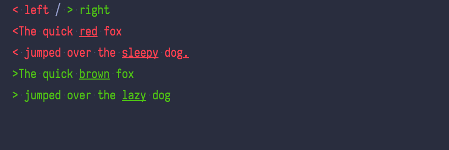

# termdiff

Diff a string for presentation to a user in the terminal.

## Usage

``` rust
use termdiff::{SignsTheme, DrawDiff};
let old = "The quick brown fox and\njumps over the sleepy dog";
let new = "The quick red fox and\njumps over the lazy dog";
let theme = SignsTheme::default();
let actual = format!("{}", DrawDiff::new(old, new, &theme));

assert_eq!(
    actual,
    "--- remove | insert +++
-The quick brown fox and
-jumps over the sleepy dog
+The quick red fox and
+jumps over the lazy dog
"
);
```

Alternatively you can use this interface

``` rust
use termdiff::{ArrowsTheme, diff};
let old = "The quick brown fox and\njumps over the sleepy dog";
let new = "The quick red fox and\njumps over the lazy dog";
let theme = ArrowsTheme::default();
let mut buffer: Vec<u8> = Vec::new();
diff(&mut buffer, old, new, &theme).unwrap();
let actual: String = String::from_utf8(buffer).expect("Not valid UTF-8");

assert_eq!(
    actual,
    "< left / > right
<The quick brown fox and
<jumps over the sleepy dog
>The quick red fox and
>jumps over the lazy dog
"
);
```

Read more at [Docs.rs](https://docs.rs/termdiff/)

## Themes

We have a limited number of built in themes

### Arrows


### Signs



### Custom

``` rust
use termdiff::DrawDiff;
use termdiff::Theme;
use crossterm::style::Stylize;
use std::borrow::Cow;


struct MyTheme {}
impl Theme for MyTheme {fn highlight_insert<'this>(&self, input: &'this str) -> Cow<'this, str> {
        input.into()
    }

fn highlight_delete<'this>(&self, input: &'this str) -> Cow<'this, str> {
       input.into()
    }

fn equal_content<'this>(&self, input: &'this str) -> Cow<'this, str> {
       input.into()
    }

fn delete_content<'this>(&self, input: &'this str) -> Cow<'this, str> {
       input.into()
    }

fn equal_prefix<'this>(&self) -> Cow<'this, str> {
     "=".into()
    }

fn delete_prefix<'this>(&self) -> Cow<'this, str> {
        "!".into()
    }

fn insert_line<'this>(&self, input: &'this str) -> Cow<'this, str> {
     input.into()
    }

fn insert_prefix<'this>(&self) -> Cow<'this, str> {
     "|".into()
    }

fn line_end<'this>(&self) -> Cow<'this, str> {
        "\n".into()
    }

fn header<'this>(&self) -> Cow<'this, str> {
        format!("{}\n", "Header").into()
    }}
let my_theme = MyTheme{};

let old = "The quick brown fox and\njumps over the sleepy dog";
let new = "The quick red fox and\njumps over the lazy dog";
let actual = format!("{}", DrawDiff::new(old, new, &my_theme));

assert_eq!(
    actual,
    "Header
!The quick brown fox and
!jumps over the sleepy dog
|The quick red fox and
|jumps over the lazy dog
"
);
```
